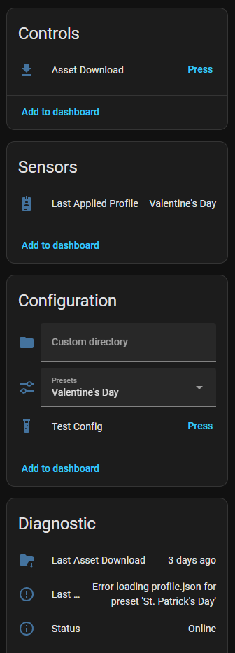

# Doorbell MQTT UniFi


**Doorbell MQTT UniFi** is a lightweight C-based service that bridges  
**UniFi Protect G4 Doorbell Pro** devices with **MQTT** and **Home Assistant**.

It enables local-only control of custom animations, sounds, and profile assets via MQTT ― without cloud dependencies or manual SSH scripting.

The service:

- Publishes Home Assistant MQTT discovery entities    
- Manages secure SSH/SCP communication with the doorbell
- Applies custom doorbell profiles (project-defined animation + sound bundles)
- Exposes automation-friendly status and control topics
- Runs cleanly inside Docker

This project is designed for Home Assistant users who want deeper control over their UniFi doorbell.

---

## ⚠️ Audience & Safety Notes

This is **not an official UniFi tool**.

This project is intended for users who:

- Are comfortable with MQTT and Home Assistant    
- Understand SSH access and device-level file modification
- Are comfortable editing JSON configuration files
- Accept the risks of modifying files on embedded devices

The doorbell typically self-heals by re-syncing configuration from UniFi Protect after a reboot. However, misuse may temporarily remove custom sounds or animations.

Use at your own risk.

---

## Features

- Home Assistant MQTT Discovery (auto-created entities)    
- Preset profile application
- Custom profile uploads
- Doorbell profile download
- MQTT availability + structured status reporting
- Graceful shutdown (SIGINT / SIGTERM safe)
- Docker-friendly logging (stdout/stderr)
- Environment-variable overrides for container use
- Unit-tested core components (Unity)

---
## Architecture Overview

The service runs as an MQTT-driven worker. It maintains minimal persistent state to restore the last applied profile and republish correct Home Assistant entity states after restarts.

### Apply profile flow

1. Home Assistant sends a command via MQTT
2. The service:
    - Validates profile assets
    - Connects over SSH
    - Uploads assets via SCP
    - Applies the profile
3. Status and results are published back to MQTT
### Download active doorbell assets flow

1. Home Assistant sends a download command via MQTT
2. The service:
    - Connects over SSH
    - Downloads the currently active doorbell assets (including configuration `.conf` files, animation, and sound)
    - Saves them into a local profile directory for inspection or reuse
3. Status and results are published back to MQTT

Downloaded `.conf` files are saved for reference and troubleshooting and are not required when reapplying a profile.

No polling. No cloud dependencies. No persistent background agent on the doorbell.

---

## Home Assistant Integration

The service publishes MQTT discovery payloads so Home Assistant automatically creates entities for control and status.



Entities include:

- Download Assets button
- Last Applied Profile sensor
- Custom Profile Directory input
- Preset Profile selector
- Test Config button
- Last Asset Download timestamp sensor
- Last Error sensor
- Status sensor    

This makes automation straightforward inside Home Assistant.

---
## Quick Start (Docker Recommended)

On first startup, if `/config/config.json` does not exist, the container will generate a sample configuration file.

In Docker, `localhost` refers to the container itself. Set `MQTT_HOST` and `SSH_HOST` to your broker and doorbell IP addresses.

The only required environment variable is:

- `UNIFI_PROTECT_RECOVERY_CODE`

All other settings may be configured in `config.json` or overridden via environment variables.

### Minimal docker run Example

```bash
docker run -d \
  --name doorbell-mqtt-unifi \
  --restart unless-stopped \
  -e UNIFI_PROTECT_RECOVERY_CODE=your_recovery_code \
  -v /path/to/doorbell-mqtt-unifi/config:/config \
  -v /path/to/doorbell-mqtt-unifi/profiles:/profiles \
  ghcr.io/chrishansentech/doorbell-mqtt-unifi:latest
```

After the container starts:

1. Edit `/path/to/doorbell-mqtt-unifi/config/config.json`
2. Set your MQTT and SSH settings
3. Restart the container

Configuration is read on startup. Restart the container after modifying `config.json`.

```bash
docker restart doorbell-mqtt-unifi
```

---

### Optional: Environment Variable Overrides

You may override any `config.json` value using uppercase `SECTION_KEY` environment variables.

Example:

```text
-e MQTT_HOST=192.168.1.40 
-e MQTT_PORT=1883 
-e SSH_HOST=192.168.1.135
```

Environment variables take precedence over `config.json`.

---
### Expected Directory Structure

```text
/path/to/doorbell-mqtt-unifi/ 
├── config/ 
│  	└── config.json 
└── profiles/     
	├── christmas/     
	├── new_years/     
	└── st_pats/
```

Profiles must follow the structure documented in `docs/profiles.md`.

---

## Building from Source

### Prerequisites

- GCC or Clang
- pkg-config
- Eclipse Paho MQTT C client (`libpaho-mqtt3c`)
- libssh2
- OpenSSL headers
    
On Debian/Ubuntu:

```bash
sudo apt install build-essential pkg-config libpaho-mqtt-dev libssh2-1-dev libssl-dev
```

### Build

```bash
make          # optimized build
make debug    # debug build (-O0 -g3)
```

### Run

```bash
./bin/doorbell-mqtt-unifi
```

---

## Configuration

Configuration is loaded from `config.json`.

Environment variables override JSON values when set (ideal for Docker deployments).

Start from `config.example.json`.

### Minimal Example

```json
{
  "mqtt": {
    "host": "localhost",
    "port": 1883,
    "prefix": "chrishansentech",
    "instance": "default"
  },
  "ssh": {
    "host": "192.168.1.135",
    "port": 22,
    "user": "ubnt",
    "password_env": "UNIFI_PROTECT_RECOVERY_CODE"
  },
  "presets": [
    { "name": "Christmas", "directory": "christmas" },
    { "name": "New Years", "directory": "new_years" },
    { "name": "St. Patrick's Day", "directory": "st_pats" }
  ]
}
```

---

## Profiles

Profiles live under:

```
profiles/<name>/
```

Each profile must include:

- `profile.json`
- One `.png` animation file
- One `.ogg` sound file
    
### profile.json Example

```json
{
  "schemaVersion": 1,
  "welcome": {
    "enabled": true,
    "file": "christmas.png",
    "count": 57,
    "durationMs": 100,
    "loop": true,
    "guiId": "WELCOME"
  },
  "ringButton": {
    "enabled": true,
    "file": "christmas.ogg",
    "repeatTimes": 1,
    "volume": 100,
    "soundStateName": "RING_BUTTON_PRESSED"
  }
}
```

When `enabled=false`, the service will either clear the animation (welcome) or leave the existing ring sound unchanged. See `docs/profiles.md` for detailed behavior.

---

## Repository Structure

```
├── src/                 # Core service logic
├── include/             # Public headers
├── profiles/            # Presets + downloads
├── tests/               # Unity-based unit tests
├── build/               # Build artifacts
├── bin/                 # Compiled binary
├── config.example.json  # Configuration template
├── Makefile
└── Dockerfile
```

---

## Roadmap

- Default profile fallback support and related Home Assistant controls
- Partial-failure rollback safety
- Support additional animation `guiId` values to allow changing additional animations on the doorbell.
---
## License

MIT License — see `LICENSE`.
